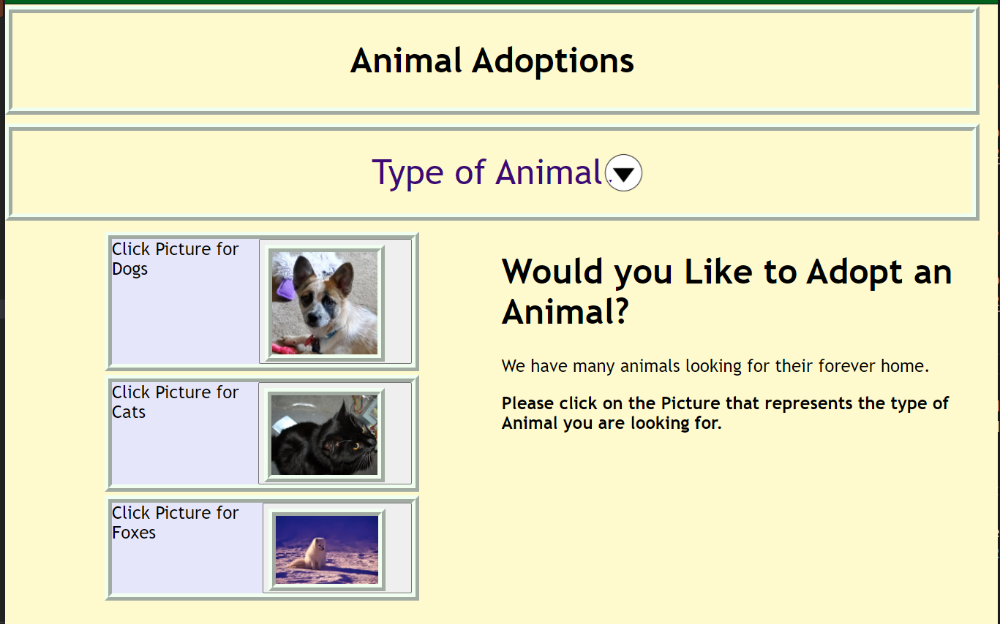

# AnimalAdoptions
````
As AN owner of a Animal Rescue with a growing customer rate
I WANT a website that allows customers to pick out their Animal and adopt it.
SO THAT I can continue to build rapport with customers.

This is the inital wireframe of the project:
````


````
# Psuedo Code
-Selector for type of Animal/adoption
-Search bar for easy access
-Local storage for user input
-Dropdown list for all types of etc
-Result for all the selected items

Presentation:
````


````
Website pages:
````





